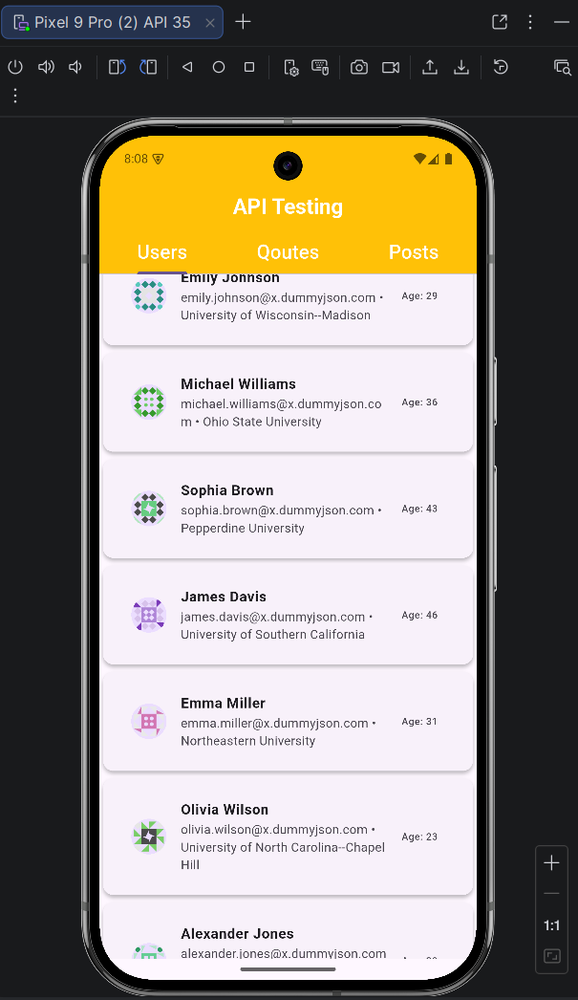
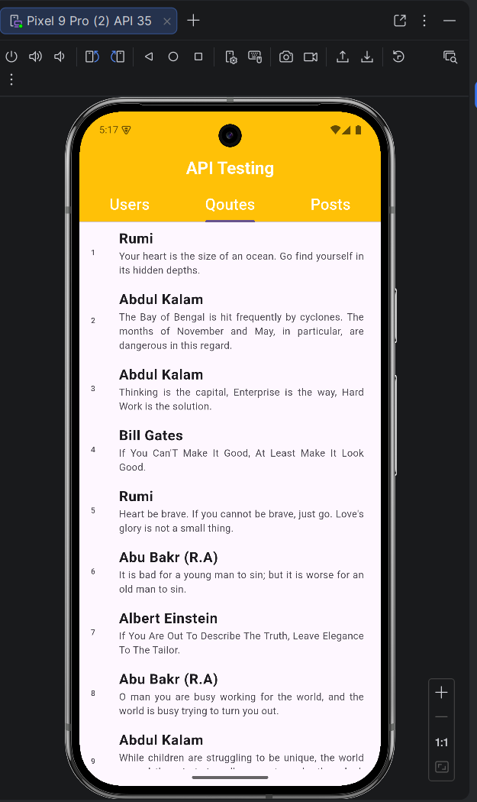
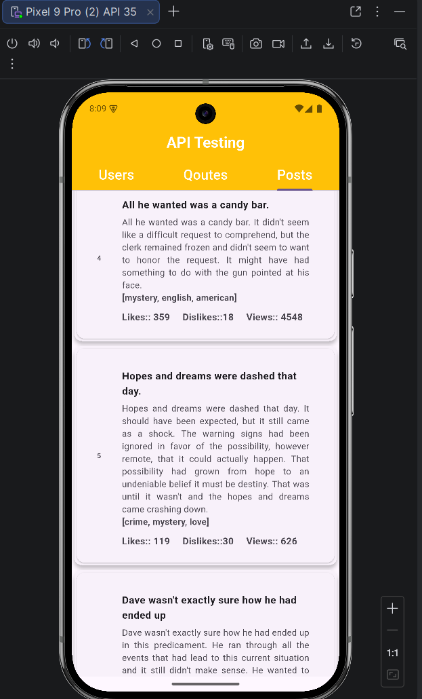

## 🚀 Flutter API Multi-Tab App

A Flutter application demonstrating REST API integration, JSON model parsing, service-layer architecture, and asynchronous state management using FutureBuilder.

This project fetches and displays data from multiple endpoints including Users, Quotes, and Posts.

---

## 📱 Features

🔹 Fetch data from REST APIs

🔹 Parse JSON into Dart model classes

🔹 Service-layer architecture (separation of concerns)

🔹 Async state handling using FutureBuilder

🔹 Tab navigation (Users / Quotes / Posts)

🔹 Loading indicators and error handling

🔹 Clean folder structure

---
## 📸 Screenshots

>/screenshots
├── users.png
└── posts.png
└── quotes.png


| Users Screen               | Quotes Screen               | Posts Screen               |
|----------------------------|-----------------------------|----------------------------|
|  |  |  |

---

## 📂 Project Structure

The project follows a basic layered structure:
```
lib/
├── main.dart
├── Models/
│     ├── posts.dart
│     ├── quotes.dart
│     └── test.dart
│
├── services/
│     └── api_service.dart
│
└── Screens/
└── home_screen.dart
```
## 🔹 Models

* Generated using JSON-to-Dart plugin to convert API responses into structured Dart classes.

## 🔹 Services

* Contains all API logic inside ApiService, keeping UI clean and maintainable.

## 🔹 Screens

* Responsible only for UI rendering and displaying data.

---

## 🌐 APIs Used

Data is fetched from:

https://dummyjson.com/users

https://dummyjson.com/quotes

https://dummyjson.com/posts

---

## ⚙️ Technologies Used

🔹 **Flutter**

🔹 **Dart**

🔹 **HTTP package**

🔹 **REST APIs**

🔹 **FutureBuilder**

🔹 **JSON parsing**

---

## 🚀 How to Run the Project

1. Clone the repository:

```bash
git clone https://github.com/Dev-Muhammad-Faizan/flutter-lottery-app.git
```

2. Navigate to the project directory:

```bash
cd flutter-lottery-app
```

3. Install dependencies:

```bash
flutter pub get
```

4. Run the app:

```bash
flutter run
```

---
## 🎯 Learning Outcomes

This project demonstrates:

* Understanding of asynchronous programming in Flutter

* Handling network requests and API responses

* Clean code structure with service-layer separation

* Dynamic UI rendering from remote data

---
## 👨‍💻 Author

**Muhammad Faizan**
BS Software Engineering Student
Flutter & Mobile App Development Learner

---

⭐ If you like this project, feel free to star the repository!


